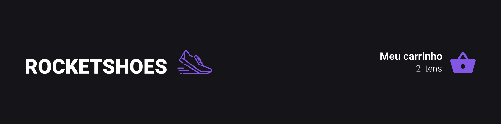

  

   

## Sobre 📖
Esta aplicação foi desenvolvida como desafio do **Chapter II (Ignite - Rocketseat)**. Nesse desafio, o seu principal objetivo é criar um hook de carrinho de compras que possibilite as ações listadas abaixo.

## Desafios 🏆
- [ ] Adicionar um novo produto ao carrinho;
- [ ] Remover um produto do carrinho;
- [ ] Alterar a quantidade de um produto no carrinho;
- [ ] Cálculo dos preços sub-total e total do carrinho;
- [ ] Validação de estoque;
- [ ] Exibição de mensagens de erro;

## Preview 📷

  

